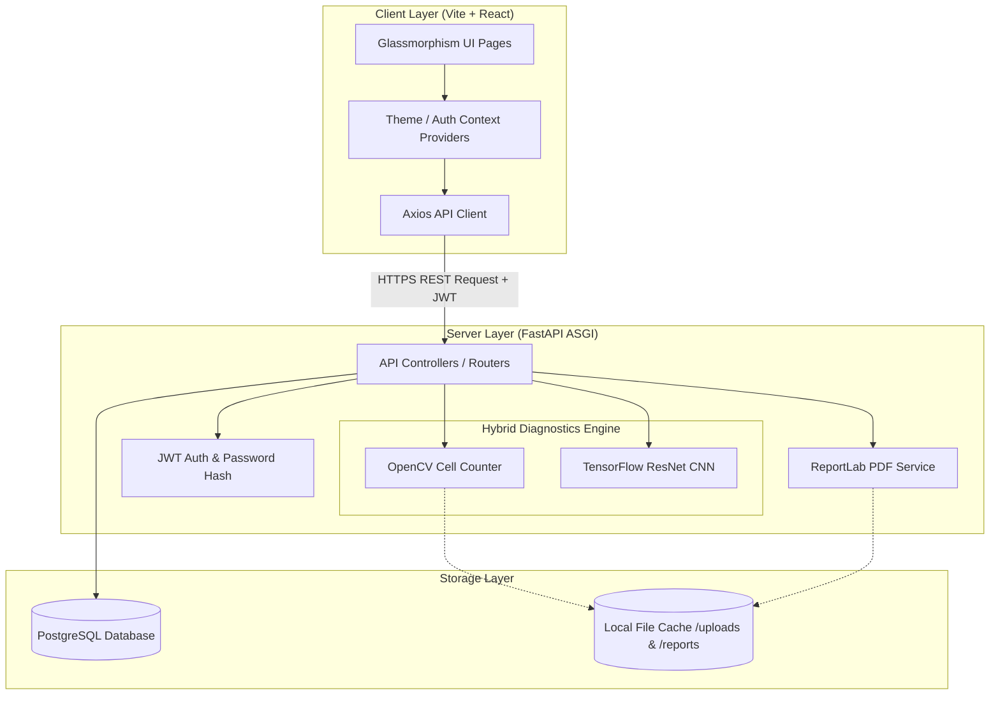
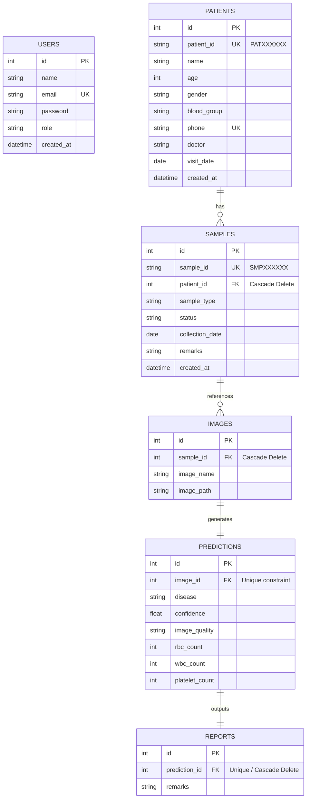
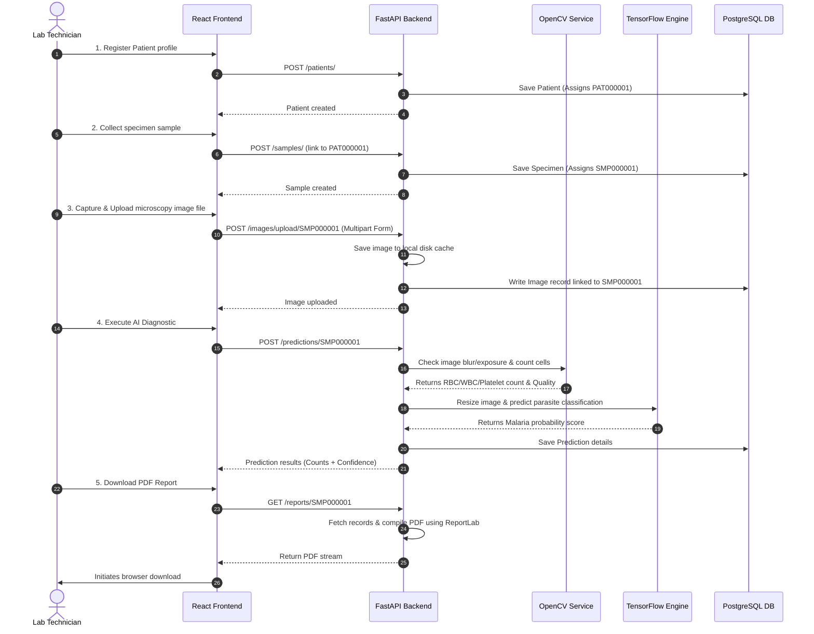

# LabVision AI — Clinical Pathology & Neural Cell Workspace

LabVision AI is a production-grade clinical imaging workspace that connects patient intake, specimen tracking, microscopic smear uploads, neural diagnostics (malaria parasite screening), automated cell counting, and official PDF report generation into a unified laboratory pipeline. 

The project features a **React 19 + TypeScript** frontend with a responsive glassmorphism UI, a **FastAPI** backend, and a hybrid processing engine combining **TensorFlow CNN inference** and **OpenCV computer vision**.

---

## 1. The Problem & Solution

### The Problem
Traditional pathology workflows for blood smear microscopy suffer from three main bottlenecks:
1. **Manual Labor & Fatigue**: Technicians manually inspect hundreds of fields of view under light microscopes, leading to cognitive fatigue and slower turnaround times.
2. **Inter-Observer Variability**: Visual cell quantification (Red Blood Cells, White Blood Cells, Platelets) and parasite detection can be subjective, leading to inconsistent clinical results.
3. **Workflow Fragmentation**: Patient registration, sample collection, image storage, diagnostics, and patient billing often reside in disconnected software systems.

### The Solution
LabVision AI provides a single unified workspace to solve these issues:
* **Structured Business Identifiers**: Auto-generated codes connect patients (`PATXXXXXX`) and specimens (`SMPXXXXXX`) to maintain traceability.
* **Computer-Vision Assistance**: Automated cell boundary segmentation and counting helps standardise cell quantification.
* **Deep Learning Inference**: A custom Convolutional Neural Network (CNN) scans thin/thick blood smears to detect *Plasmodium falciparum* parasites (malaria screening).
* **Automated PDF Export**: Instantly compiles patient profiles, cell metrics, slide quality indicators, and AI results into structured clinical reports.

---

## 2. Tech Stack

| Tier | Component | Technology Used | Description |
| :--- | :--- | :--- | :--- |
| **Frontend** | Framework | React 19 + TypeScript | Core UI library & type safety |
| | Tooling | Vite | Fast client building & Hot Module Replacement |
| | Routing | React Router DOM v7 | Declared application routes & navigation |
| | CSS / Style | Tailwind CSS v4 + Vanilla CSS | Curated dark mode & glassmorphism theme |
| | Animations | Framer Motion | Smooth dashboard page and transition effects |
| | Utilities | Axios, React Icons, React Hot Toast | API queries, icons, and toast feedback |
| **Backend** | Framework | FastAPI | Async Python REST API framework |
| | Server | Uvicorn | High-performance ASGI server |
| | Database ORM | SQLAlchemy | SQL engine abstraction and relationship model |
| | Validation | Pydantic v2 | Input validation schemas & serialization |
| | Security | JWT (python-jose), bcrypt (passlib) | Bearer auth & password hashing |
| **AI / CV** | ML Inference | TensorFlow / Keras | CNN model execution (`trained_model.h5`) |
| | Image Processing | OpenCV, Pillow, NumPy | Image transformation, array math, cell contours |
| **Reporting** | PDF Generation | ReportLab | Programmatic canvas rendering of PDF reports |
| **Database** | Database Engine | PostgreSQL | Relational storage for transaction integrity |

---

## 3. System Architecture

The application implements a classic **Three-Tier Architecture** consisting of a client application, an asynchronous application server (hosting the ML inference and CV engines), and a relational database.



### Key Engineering Details:
1. **Asynchronous Architecture**: FastAPI handles HTTP requests asynchronously, freeing the worker process while database operations yield control.
2. **In-Memory ML Model Loading**: The TensorFlow CNN model (`trained_model.h5`) is loaded into memory exactly **once** during startup at [`prediction_service.py`](file:///c:/Users/ANINDITA/Desktop/LabVision%20AI/backend/app/services/prediction_service.py#L17-L19). Subsequent API requests reuse the loaded weights to eliminate the cost of model loading during request-response cycles.
3. **OpenCV Segregation**: Image preprocessing and mathematical contours run on CPU, feeding preprocessed NumPy arrays `(224, 224, 3)` directly to the loaded Keras model.

---

## 4. Database Schema & Connection Pooling

LabVision AI uses a relational schema with cascade deletion rules to maintain data integrity.

### Entity-Relationship Diagram (ERD)



### Cloud Database & Connectivity (SQLAlchemy)
To operate securely in cloud environments (such as Neon, Supabase, or AWS RDS), connection stability is critical. The connection configuration at [`database.py`](file:///c:/Users/ANINDITA/Desktop/LabVision%20AI/backend/app/core/database.py#L5-L16) is defined as follows:

```python
engine = create_engine(
    DATABASE_URL,
    pool_pre_ping=True
)
```
* **`pool_pre_ping=True`**: Before executing SQL commands, SQLAlchemy issues a silent test query (like `SELECT 1`) to check if the connection is alive. If the cloud database has closed the connection due to idle timeouts, the engine transparently recycles it, avoiding `ConnectionResetError` exceptions.

---

## 5. API Endpoints (FastAPI)

All non-auth API endpoints require a `Authorization: Bearer <JWT_TOKEN>` header.

| Tag | HTTP Method | Path | Auth Required | Payload | Response Model | Description |
| :--- | :--- | :--- | :---: | :--- | :--- | :--- |
| **Auth** | `POST` | `/auth/register` | No | `UserCreate` | `UserResponse` | Registers a new practitioner. |
| | `POST` | `/auth/login` | No | `UserLogin` | `TokenResponse` | Authenticates and returns a JWT token. |
| | `GET` | `/auth/me` | Yes | — | `UserResponse` | Fetches active practitioner profile. |
| **Patients** | `POST` | `/patients/` | Yes | `PatientCreate` | `PatientRecord` | Creates a new patient record. |
| | `GET` | `/patients/` | Yes | — | `List[PatientRecord]` | Fetches all patient files. |
| | `GET` | `/patients/{id}` | Yes | — | `PatientRecord` | Retrieves a specific patient. |
| | `PUT` | `/patients/{id}` | Yes | `PatientUpdate` | `PatientRecord` | Modifies an existing patient's details. |
| | `DELETE`| `/patients/{id}` | Yes | — | `StatusMessage` | Deletes patient (cascades to samples). |
| **Samples** | `POST` | `/samples/` | Yes | `SampleCreate` | `SampleRecord` | Creates sample linked to `patient_code`. |
| | `GET` | `/samples/` | Yes | — | `List[SampleRecord]` | Lists specimen records. |
| **Images** | `POST` | `/images/upload/{sample_id}`| Yes | Form data (file) | `ImageRecord` | Ingests slide scan, saves to file cache. |
| **Prediction**| `POST` | `/predictions/{sample_code}`| Yes | — | `PredictionResponse` | Runs OpenCV + TF models on slide. |
| **Reports** | `GET` | `/reports/{sample_code}` | Yes | — | Binary PDF | Generates and downloads PDF report. |

---

## 6. Frontend Routing

The frontend utilizes React Router with client-side guarding. If an unauthenticated user attempts to access any dashboard path, they are automatically redirected to `/login` via the `ProtectedRoute` component.

```text
├── Public Routes (Unprotected)
│   ├── /                      --> Landing page (Overview, features, FAQ, CTA buttons)
│   ├── /login                 --> Secured SignIn portal
│   └── /register              --> Practitioner account sign-up page
│
└── Protected Routes (Dashboard Layout Container)
    ├── /dashboard             --> Operational intelligence stats & feature metrics
    ├── /patients              --> Create patient records & view patient database
    ├── /samples               --> Specimen registry, intake, and lifecycle tracker
    ├── /upload                --> Ingest blood smear microscopy files
    ├── /prediction            --> AI neural classification & metric outcomes
    └── /reports               --> Automated PDF report generator & history exporter
```

---

## 7. End-to-End Clinical Workflow

Below is the step-by-step process of a blood sample analysis inside LabVision AI:



---

## 8. Technical Deep-Dive (Interview Q&A Prep)

### Q1: How does the hybrid AI / Computer Vision prediction engine work?
The prediction endpoint does not rely on a single model. It partitions processing into two tasks:
1. **Geometric Counting (OpenCV)**:
   * **RBCs**: The grayscale image is smoothed with a Gaussian Filter `(5, 5)` to eliminate noise, then passed to the **Hough Circles Transform** (`cv2.HoughCircles`). This detects circular structures matching the physical diameter boundaries of red blood cells.
   * **WBCs**: White blood cells have prominent purple/violet stained nuclei (due to Giemsa stain). The service converts the image to **HSV color space** and applies an in-range threshold mask mapping purple hues (`[100, 40, 40]` to `[170, 255, 255]`). It counts distinct islands using `cv2.findContours`.
   * **Platelets**: Very small, low-contrast cell fragments. The engine thresholds the grayscale channel and counts contours where the area falls in a strict boundary (`2 < area < 50` pixels).
2. **Deep Learning Classification (TensorFlow)**:
   * The image is resized to `(224, 224)`, normalized to range `[0.0, 1.0]`, and shaped to fit batch dimension `(1, 224, 224, 3)`.
   * It is run through the convolutional layers of `trained_model.h5`. A final sigmoid activation function returns a floating-point prediction value representing the probability of Malaria. Values `> 0.5` are diagnosed as positive.

### Q2: How does the system handle image quality issues (e.g. blurry/overexposed slides)?
Before running the neural classifier, the image is passed to `check_image_quality`.
* **Focus Check**: Applies a **Laplacian operator** to compute the variance of the image Laplacian. A variance score below `80` indicates high blur (out of focus), returning a quality warning.
* **Exposure Check**: Computes the mean grayscale value. A mean value `< 50` indicates a slide that is too dark (underexposed), while a mean value `> 220` denotes overexposure.

### Q3: How is HIPAA compliance maintained?
* **Protected Routes**: React router blocks access to patients/samples pages without a validated token.
* **Authentication**: Password hashes are stored using **bcrypt** with a work-factor salt. JWT access tokens are signed with `HS256` and have a configured expiration time (e.g., 30 minutes).
* **Data Privacy**: The database schema isolates patient identity (name, phone) and links to samples and medical reports using random or sequential codes (`PAT000001`), providing a layer of pseudonymization.

---

## 9. Installation & Local Setup

### Prerequisites
* **Python 3.11**
* **Node.js 18+**
* **PostgreSQL** instance running locally or on the cloud

### Backend Setup
1. Navigate to the backend directory:
   ```bash
   cd backend
   ```
2. Create and activate a virtual environment:
   ```bash
   python -m venv .venv
   .venv\Scripts\activate
   ```
3. Install dependencies:
   ```bash
   pip install -r requirements.txt
   ```
4. Create a `.env` file in the `backend/` directory:
   ```env
   DATABASE_URL=postgresql://<user>:<password>@localhost:5432/<dbname>
   SECRET_KEY=your-jwt-signing-secret-key-string
   ALGORITHM=HS256
   ACCESS_TOKEN_EXPIRE_MINUTES=30
   ```
5. Start the FastAPI server using Uvicorn:
   ```bash
   uvicorn app.main:app --reload
   ```
   The backend API will be available at `http://127.0.0.1:8000`.

### Frontend Setup
1. Navigate to the frontend directory:
   ```bash
   cd frontend
   ```
2. Install Node packages:
   ```bash
   npm install
   ```
3. Run the Vite development server:
   ```bash
   npm run dev
   ```
   The web application will open at `http://localhost:5173`.

### Author

Created by Rajdeep Podder 